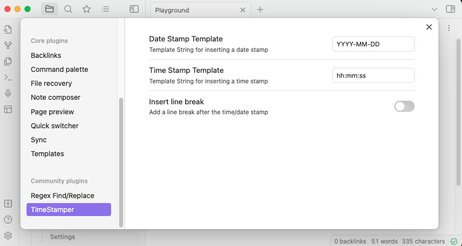
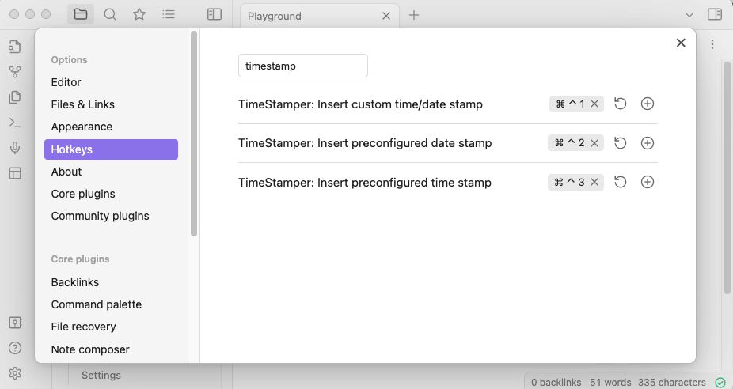

# Time Stamper - Obsidian Plugin
Add time- or date stamps to your note:
- Two format strings can be pre-configured in the plugin settings (and inserted via command or hot-key)
- An ad-hoc customized time stamp can be inserted via a dialog (last recently used format is saved and provided as suggestion)

Desktop as well as mobile versions of Obsidian are supported.

## Plugin Settings
The plugin comes with some options for configuration:
- A default template string for quick-insert of a time stamp (via command or configurable hot-key)
- A default template string for quick-insert of a date stamp (via command or configurable hot-key)
- An option to specify if a line-break should be added after the inserted time/date stamp automatically

## Hotkey Configuration
Hot-Keys can be configured for in the Obsidian Hotkeys-Options Page for quick access to the following commands:
- Open dialog to enter a custom time/date format string
- Insert pre-defined time stamp
- Insert pre-defined date stamp

## Format String
The plugin uses moment.js which comes with Obsidian by default, hence all known tokens from moment.js can be used to create your customized time/date stamp:
[Full ist of supported tokens](https://momentjscom.readthedocs.io/en/latest/moment/04-displaying/01-format/)

|                             | Token              | Output                                   |
| --------------------------- | ------------------ | ---------------------------------------- |
| Month                       | M                  | 1 2 ... 11 12                            |
|                             | Mo                 | 1st 2nd ... 11th 12th                    |
|                             | MM                 | 01 02 ... 11 12                          |
|                             | MMM                | Jan Feb ... Nov Dec                      |
|                             | MMMM               | January February ... November  December  |
| Quarter                     | Q                  | 1 2 3 4                                  |
|                             | Qo                 | 1st 2nd 3rd 4th                          |
| Day of  Month               | D                  | 1 2 ... 30 31                            |
|                             | Do                 | 1st 2nd ... 30th 31st                    |
|                             | DD                 | 01 02 ... 30 31                          |
| Day of  Year                | DDD                | 1 2 ... 364 365                          |
|                             | DDDo               | 1st 2nd ... 364th 365th                  |
|                             | DDDD               | 001 002 ... 364 365                      |
| Day of  Week                | d                  | 0 1 ... 5 6                              |
|                             | do                 | 0th 1st ... 5th 6th                      |
|                             | dd                 | Su Mo ... Fr Sa                          |
|                             | ddd                | Sun Mon ... Fri Sat                      |
|                             | dddd               | Sunday Monday ... Friday  Saturday       |
| Day of  Week (Locale)       | e                  | 0 1 ... 5 6                              |
| Day of  Week (ISO)          | E                  | 1 2 ... 6 7                              |
| Week of  Year               | w                  | 1 2 ... 52 53                            |
|                             | wo                 | 1st 2nd ... 52nd 53rd                    |
|                             | ww                 | 01 02 ... 52 53                          |
| Week of  Year (ISO)         | W                  | 1 2 ... 52 53                            |
|                             | Wo                 | 1st 2nd ... 52nd 53rd                    |
|                             | WW                 | 01 02 ... 52 53                          |
| Year                        | YY                 | 70 71 ... 29 30                          |
|                             | YYYY               | 1970 1971 ... 2029 2030                  |
| Era  Year                   | y                  | 1 2 ... 2020 ...                         |
| Week  Year                  | gg                 | 70 71 ... 29 30                          |
|                             | gggg               | 1970 1971 ... 2029 2030                  |
| Week  Year (ISO)            | GG                 | 70 71 ... 29 30                          |
|                             | GGGG               | 1970 1971 ... 2029 2030                  |
| AM/PM                       | A                  | AM PM                                    |
|                             | a                  | am pm                                    |
| Hour                        | H                  | 0 1 ... 22 23                            |
|                             | HH                 | 00 01 ... 22 23                          |
|                             | h                  | 1 2 ... 11 12                            |
|                             | hh                 | 01 02 ... 11 12                          |
|                             | k                  | 1 2 ... 23 24                            |
|                             | kk                 | 01 02 ... 23 24                          |
| Minute                      | m                  | 0 1 ... 58 59                            |
|                             | mm                 | 00 01 ... 58 59                          |
| Second                      | s                  | 0 1 ... 58 59                            |
|                             | ss                 | 00 01 ... 58 59                          |
| Fractional  Second          | S                  | 0 1 ... 8 9                              |
|                             | SS                 | 00 01 ... 98 99                          |
|                             | SSS                | 000 001 ... 998 999                      |
|                             | SSSS ... SSSSSSSSS | 000[0..] 001[0..] ... 998[0..]  999[0..] |
| Time  Zone                  | z or zz            | EST CST ... MST PST                      |
|                             | Z                  | -07:00 -06:00 ... +06:00 +07:00          |
|                             | ZZ                 | -0700 -0600 ... +0600 +0700              |
| Unix  Timestamp             | X                  | 1360013296                               |
| Unix  Millisecond Timestamp | x                  | 1,36001E+12                              |
